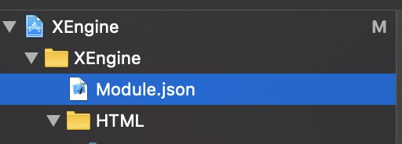

# iOS 平台可选模块接入指引

### 1. 导入工程

通过pod导入

```objc
pod 'JsApiTest'
```

### 2. 配置工程

###### 首次使用 可选模块， 需要在导入模块后 ，在工程目录下，创建一个json配置文件用于注册模块



json格式  

```json
{
  "Modules":[
      {
        "nameSpace":"echo",
        "ModuleName":"JsApiTest"
      
      },
      {
       "nameSpace":"xxx",
       "ModuleName":"xxxxxxxxxxx"
      }
  ]
}
```

###### nameSpace 请参考 nameSpace值表 [nameSpace表](xxxxxxxx)

###### ModuleName为 模块名称

### 3 使用模块

###### 如果无需自定义功能 可按照模块Api 开始使用。

###### 模块Api参见 [模块API表](https://github.com/lgy881228/docs/blob/master/document_js/UI模块使用文档.md)

### 4 自定义模块功能

1. 自定义一个新的类 继承NSObject 即可

2. 更改json 中ModuleName  

3. ```json
   {
     "Modules":[
         {
           "nameSpace":"echo",
           "ModuleName":"yourClassName"
         
         },
         {
          "nameSpace":"xxx",
          "ModuleName":"xxxxxxxxxxx"
         }
     ]
   }
   ```

4. 在回调方法中接收 数据 并处理

5. 异步方法

   ```objective-c
   - (void)funcName:(NSString *)jsonString complate:(XEngineCallBack)completionHandler
   {
     // funcName 函数名称（方法名）
     // jsonString js传过来的数据。是个 json串 需要解析使用
     // 可以使用sdk 提供的解析方法 也可以自己解析
     NSDictionary *param = [JSONToDictionary toDictionary:jsonString];
       if (param)
       {
       }
     
     
     // completionHandler 回调block
      //如果js需要 参数回调需要调用这个block 把数据回调给js
     // typedef void (^XEngineCallBack)(NSString * _Nullable result,BOOL complete);
     	NSString *jsonStr = [JSONToDictionary toString:result];
   		completionHandler(jsonStr, YES);
   }
   ```

   funcName 请参考模块 API表 [模块API表](https://github.com/lgy881228/docs/blob/master/document_js/UI模块使用文档.md)

6. 同步方法

   ```objective-c
   - (id) funcName:(NSString *) jsonString
   {
     // funcName 函数名称（方法名）
     // jsonString js传过来的数据。是个 json串 需要解析使用
     // 可以使用sdk 提供的解析方法 也可以自己解析 方法见 “异步方法”
       return jsonString;
   }
   ```

   funcName 请参考模块API表 [模块API表](https://github.com/lgy881228/docs/blob/master/document_js/UI模块使用文档.md)


